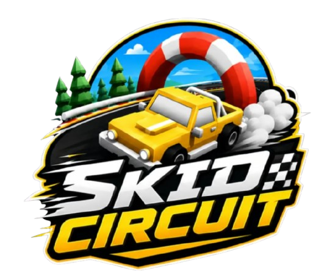

<p align="center">
  
</p>

# Skid Circuit

A fast, arcade-style browser racing game built with **Three.js**. Race custom tracks, drift and drop mods on cars, compete live against other players, climb weekly cups, and build your own circuits in the in-browser track editor.

## Features

- **Racing & physics** — arcade handling with drift, boost pads, bumps, and crash feedback (camera shake, impact sound)
- **Multiplayer** — real-time races against other players over WebRTC, live in-race leaderboard
- **Track Editor** (`editor.html`) — paint tracks tile-by-tile (straights, corners, bumps, finish line) with rotation controls, then share them
- **Track Share Board / Browser** (`share.html`, `tracks.html`) — publish and discover community tracks
- **Track of the Day** (`totd.html`) — a featured community track, refreshed regularly
- **Campaign** (`campaign.html`) — structured single-player stages and goals
- **Clubs** (`clubs.html`) — group up with other racers
- **Competitions** (`competitions.html`) & **Weekly Cup** (`weekly-cup.html`) — timed events and leaderboards
- **Coin Leaderboard** (`coins.html`) — track top earners
- **Custom Mods** (`custommods.html`, `mods.html`) — gameplay/visual mods you can build and load into races
- **Replay Watcher** (`replay.html`) & **TAS Editor** (`tas-viewer.html`) — watch ghost replays and build frame-perfect TAS runs
- **Ghost data & ghosting** — race against your own or others' best-lap replays
- Installable as a **PWA** (manifest + icons)

## Controls

- **Drive**: `W/A/S/D` or arrow keys
- **Respawn**: on-screen button
- **Toggle camera mode**: `C` (Overview / Chase camera with smoothed yaw)
- Mobile has its own touch controls and a dedicated mobile debug/testing menu (mobile only — not shown on desktop)

## Project structure

```
index.html            Main game (home, race, garage, settings)
editor.html            Track editor
tracks.html / share.html / totd.html   Track browsing & sharing
campaign.html          Single-player campaign
clubs.html             Clubs
competitions.html / weekly-cup.html    Timed events
coins.html             Coin leaderboard
custommods.html / mods.html            Mod tools & browser
replay.html / tas-viewer.html          Replay & TAS editor

js/                    Game engine modules (Vehicle, Physics, Track, Camera,
                       Controls, Audio, Particles, FirebaseMultiplayer, ...)
models/                Vehicle & track GLB models
sprites/               Particle textures
audio/                 Music & SFX
icons/                 PWA icons + favicon
branding/              Logo assets
backgrounds/           Loading screen background images (see backgrounds/README.md)
```

## Running locally

This is a static site — no build step required. Serve the folder with any static file server and open `index.html`:

```bash
npx serve .
# or
python3 -m http.server 8080
```

Then visit `http://localhost:<port>/index.html`.

## Multiplayer & backend

Multiplayer uses WebRTC peer connections (see `js/FirebaseMultiplayer.js` and `js/firebase-config.js`) for real-time sync, with Firebase used for room signaling / persistence where noted in code. No server-side build is required to run the game locally, but multiplayer features need a valid Firebase config.

## Contributing / customizing

- **Loading screen backgrounds**: see [`backgrounds/README.md`](backgrounds/README.md)
- **Track editor**: open `editor.html` to paint and export tracks
- **Mods**: see `custommods.html` for building custom gameplay mods
